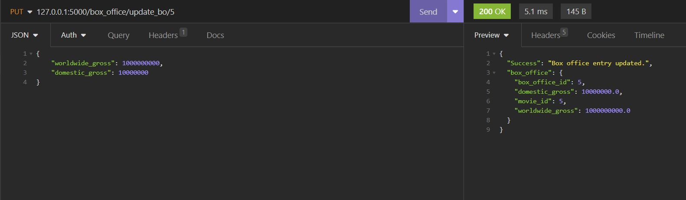

# **Luke Mastrocola**
# **ID:** T2A2 | **Title:** API Webserver Project
<br>

## **R1** 	Identification of the problem you are trying to solve by building this particular app.
<br>

By creating this app I am attempting to solve the problem of easily managing and displaying data about the highest grossing movies of all time. The application aims to offer users easy access to this data as well as providing CRUD operations in order to maintain and manipulate the data as needed.

## **R2** 	Why is it a problem that needs solving?
<br>

This app provides users to easily access to data about top grossing movies which would otherwise require manually searching through other databases or the internet in order to gather. The CRUD functionality allows for effective management of data as users can add movies to the database, delete movies, and edit certain things such as the Rotten Tomatoes Rating or the dollar amount that a particular movie has made if required. 

With the data provided, users can look into different emerging patterns of the top grossing movies and the information can be filtered in various ways to make this even easier.

## **R3**  	Why have you chosen this database system. What are the drawbacks compared to others?
<br>

I chose PostgreSQL which is open source and widely used. PSQL has many advanced features that make it great for this type of project. These features include the following.

- It has many features, often more than other similar database management systems, which allows for high customizability. 
- It is widely used and therefore has a large community of developers who can support each other.
- There is a vast amount of official documentation to provided extensive information on how it works
- It supports many widely used programming languages including Python and Flask which is what this application was made with.

Like anything, PostgreSQL has certain drawbacks which are listed below:

- PSQL is often considered to be less efficient in some use cases compared to other database management systems such as MySQL. 
- PSQL is often touted as a DBMS which requires more system resources compared to other database management systems.
- Due to its advanced features, it can require a longer learning curve compared to other database management systems which may have less functionality but is a bit easier to learn.

## **R4**   Identify and discuss the key functionalities and benefits of an ORM
<br>

ORM (Object-Relational Mapping) is used in programming and software development and allows developers to develop and manipulate relational databases with object oriented programming languages. This allows a programming language such as Python to interact with a database like PostgresQL which would otherwise not be compatible. It allows developers to work with databases as if the database were 'objects' in their programming language of choice. It adds simplicity in database development as the code is often easier to read, shorter and quicker to write. Those familiar with an object oriented programming language will find it quicker to use a relational database without having to learn all the ins and outs of that database's language and syntax, which is quite different. 

With ORM, programmers can work with databases using objects and classes which is familiar to anyone who has used this before as the code is very readable and easily written. ORM supports multiple types of databases including (but not limited to): SQL, SQLite, MySQL and PostgreSQL, among others which makes it highly flexible. 

ORM allows CRUD (Create, Read, Update, Delete) making this process more simple compared to implementing it in the database language itself. 
ORM supports working with Schemas. This means that an object oriented programming language can create, seed and delete tables in the database directly from their object oriented programming language without having to define schemas in the database directly. 
ORM also allows developers to manage relationships between tables such as one-to-one or many-to-many, in the database which makes it much easier than having to manage this in the database language. On top of this it allows the addition of managing data types and validation rules before it is passed to the database. 

Overall ORM increases productivity, makes code easier to handle, manage and read and makes it easier to expand and maintain projects using relational databases. 

## **R5**   Document all endpoints for your API
<br>

**CREATE:**

- `/post_movie` <br>
*Example:* `/post_movie/1` POSTS a new movie to the database.

*NOTE:* Use this JSON code to test posting a movie:
```
[
  {
    "name": "James Wan",
    "dob": "26/02/1977"
  },
  {
    "title": "Furious 7",
    "genre": "Action",
    "year_released": 2015,
    "runtime": "2:17:00",
    "rotten_tomatoes_rating": 81,
    "director_id": 11
  },
  {
    "worldwide_gross": 1515341399,
    "domestic_gross": 33889393,
    "movie_id": 11
  },
  {
    "lead_actor_name": "Vin Diesel",
    "lead_character_name": "Dominic Toretto",
    "movie_id": 11
  }
]
```
HTTP request verb: "POST"

Expected response data: 
- HTML response code: 200 
- A message confirming that the post has been successful 
- Printing all fields that was just added


**READ:**
- `/`
- `/all` - GETS all movies from every table.
- `/all/<int:movie_id>` - GETS a single movie from all tables based on the movie id provided in the URL. <br>
*Example:* `/all/1`

- `/all/<string:movie_title>` - GETS a single movie from all tables based on the movie title provided in the URL. <br> 
*Example:* `/all/Avatar:%20The%20Way%20of%20Water`


- `/tables/movies` - GETS all movies from the movies table.
- `/tables/movies/<int:movie_id>` - GETS a single movie from the movies table based on the movie id provided in the URL. <br> 
*Example:* `/tables/movies/1`

    
- `/tables/directors` - GETS all directors from the directors table.
- `/tables/directors/<int:directors_id>`  - GETS a single director from the directors table based on the director id provided in the URL. <br>
*Example:* `/tables/directors/1`

- `/tables/box_office` - GETS all box office entries from the box office table.
- `/tables/box_office/<int:box_office_id>` - GETS a single box office entry from the box office table based on the box office id provided in the URL. <br> 
*Example:* `/tables/box_office/1`

- `/tables/lead_actors` - GETS all lead actors from the lead actors table.
- `/tables/lead_actors/<int:lead_actors_id>` - GETS a single lead actor from the lead actors table based on the lead actors id provided in the URL. <br> 
*Example:* `/tables/lead_actors/1`

HTTP request verb: "GET"

Expected response data: 
- HTML response code: 200 
- Printing all fields that was just retrieved


**UPDATE:**
- `/movies/update_rt/<int:movie_id>` - UPDATES the rotten_tomatoes_rating field in a single movie from the movies tables based on the movie id provided in the URL <br> 
*Example:* `movies/update_rt/1`

*NOTE:* Use this JSON code to test updating the rotten_tomatoes_rating field:
```
{
    "rotten_tomatoes_rating": 50
}
```

<br>

- `/box_office/update_bo/<int:box_office_id>` - UPDATES the worldwide_gross & domestic_gross field in a single movie from the box office table based on the box office id provided in the URL <br>
*Example:* `box_office/update_bo/1`

*NOTE:* Use this JSON code to test updating the worldwide_gross & domestic_gross fields:
```
{
    "worldwide_gross": 1000000000,
    "domestic_gross": 10000000
}
```

This database doesn't require the ability to UPDATE much data. Due to the nature of the top grossing movies, I decided that if a new movie was required to be added which replaces another movie, it would be much more beneficial for data integrity to DELETE the movie that needs replacing, then add the new movie. However the box office data and rotten tomatoes rating may be subject to change. For this reason I have implemented the ability to UPDATE these fields but nothing else. Certain data about the movies will never change, such as the title, runtime, director etc so these things cannot be updated. This way, data integrity can be maintained.

HTTP request verb: "PUT"

Expected response data: 
- HTML response code: 200 
- A message confirming that the entry has been updated 
- Printing all fields that was just added



**DELETE:**
- `delete_movie/<int:movie_id>` - DELETES a single movie from the database based on the movie id provided in the URL.<br>
*Example:* `delete_movie/1`

HTTP request verb: "DELETE"

Expected response data: 
- HTML response code: 200 
- A message confirming that the deletion has been successful 


## **R6**   An ERD for your app
<br>


## **R7**   Detail any third party services that your app will use
<br>

This application uses Flask - a web app framework built specifically for Python. It is designed to make developing web applications easy and is known for its simple implementation. It allows for the creation of endpoints and generating HTML response codes among other features

This application uses Flask-SQLAlchemy - A Flask extension which integrates SQLAlchemy. SQLAlchemy is an ORM for Python and works with Flask apps. It allows the ability to manipulate databases in conjunction with Flask. It supports creating Models and Schemas, CRUD and other ways of interacting with relational databases.

This application uses Flask-Marshmallow which is also a flask extension that integrates the Marshmallow library. Marshmallow's purpose is to serialize objects which means that Python objects can essentially be converted to data types that python understands such as dictionaries and then be rendered into JSON .

This application uses psycopg2-binary. It's is essentially a type of "driver" which allows operations to be executed on PostgresQL via Python.  

## **R8**   Describe your projects models in terms of the relationships they have with each other
<br>

## **R9**   Discuss the database relations to be implemented in your application
<br>

This answer is for both question 8 and 9 as they are too similar to answer separately.

The Movies and Directors have a one-to-many relationship but currently, the relationship between the Movies and Directors tables could be a one-to-one. This was not absolutely necessary for this project but I implemented it so that not all Models had the same relationship. The Directors table does not have any columns that show the movies that each person has directed but if it would be easy to add this feature to the Directors model in the future if needed. The Movies model has a foreign key column "director_id" which is referencing the primary key of the Directors model. The relationship is created using the this code in the Directors model:
```
db.relationship
``` 
While:
```
backref=
``` 
is set to:
```
"director"
```

The Movies and BoxOffice models have a one-to-one relationship a movie has a single box office record and a box office record is linked to a single movie. The Movies model has a "box_office_id" column with represents the primary key of the BoxOffice model. The BoxOffice model has  "movie_id" column which represents the primary key of the Movies model. The relationship is created in the both models. The BoxOffice model has 

```
db.ForeignKey("movies.movie_id")
``` 


and the Movies model has 
```
box_office_id = db.relationship("BoxOffice", backref="movies", uselist=False, cascade="all, delete")
``` 
The "uselist" and "cascade" portions of this code are not used to establish the one-to-one relationship; they have other purposes.


The relationship between the Movies and LeadActors model is the same as the Movies and BoxOffice model as a movie a one leader actor and a lead actor is associated with one movie. 


## **R10**   	Describe the way tasks are allocated and tracked in your project
<br>

Tasks have been created and tracked on a Monday board. Please see the below link:

https://view.monday.com/4228466486-1b019042af2bb2a908764671437cd8d1?r=use1

Please note: I have added various notes but Monday does not allow them to be accessible via the public link.


The workflow went in this order:

- Setup project. This includes installing required libraries, creating the db, creating the first table and endpoint.
- Creating the rest of the tables and establishing the relationships. 
- Creating the GET endpoints
- Creating the POST method
- Creating the UPDATE method
- Creating the DELETE method